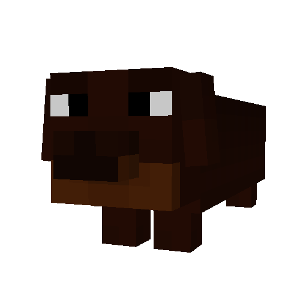
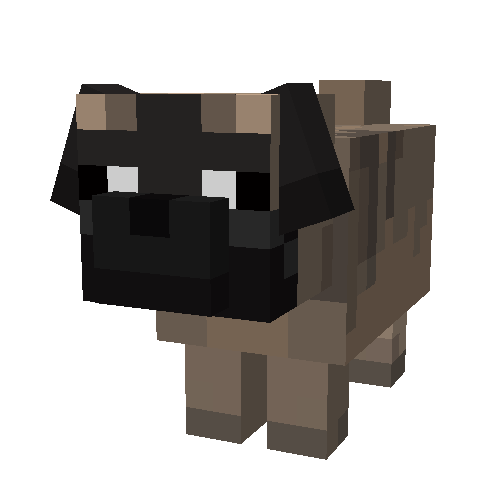
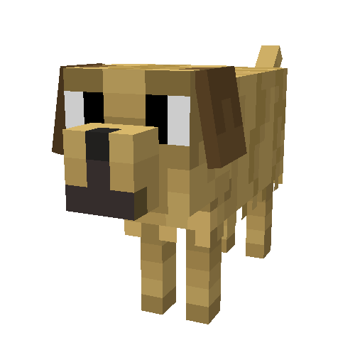
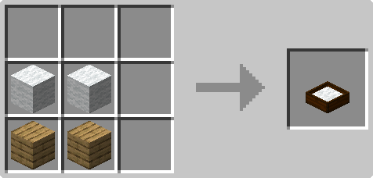
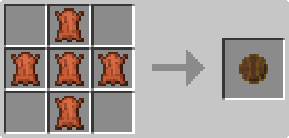
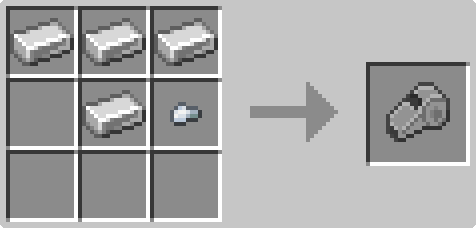
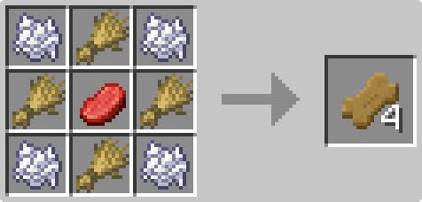

# More Pups

A Fabric mod for Minecraft 26.2 that adds proper dog breeds, and gives every dog
(including vanilla wolves) behaviour you can actually direct.

## Breeds

Three breeds, each with their own model, animations and sounds:

| Dachshund | Pug | Labrador |
|:---:|:---:|:---:|
|  |  |  |

All three have puppy variants, and breeding two dogs passes on one parent's breed.
Any dog can be given a collar in any of the sixteen dye colours, same as a vanilla
wolf.

Wild dogs spawn around villages in pairs. Not every village has them, and a village that does
will always have the same breed.

## Telling your dog what to do

Shift-right-click any tamed dog, yours or a vanilla wolf, to open its behaviour
screen.

**Follow.** Sticks close by your side instead of vanilla's loose, teleporting follow.
You set the distance.

**Guard.** Holds its position and attacks hostile mobs that come near, then walks
back to its post once the fight is over.

**Relax.** Wanders freely within a radius of wherever you set it.

**Return to Bed.** Sends the dog home to its claimed bed, walking if it's close and
teleporting if it isn't. Greyed out until the dog has claimed one.

Each mode has its own adjustable range, set with sliders on the same screen.

## Dog beds

Craft a dog bed from wool and planks. A dog set to Relax will find an unclaimed bed
nearby, claim it as its own, and sleep there at night, curled up with its eyes shut.

Beds can be dyed any of the sixteen colours and keep that colour when broken and
replaced. A claimed bed stays claimed until the dog it belongs to is gone.

## The dog whistle

Lost a dog? The whistle lists every dog you've tamed, by name, wherever they are in
the world. That includes dogs sitting in chunks that aren't even loaded.

Pick one and they'll make their own way to you.

## Dog Treats % Balls

The dog treat currently works just like a regular food item for a wolf, heal it and use it to breed. The ball is
is currently just a play item for the dogs, hold it and they'll come running up to you, throw it and they'll 
play fetch with it. These features will become part of the "Tamagotchi" style stats update planned in the roadmap below.

## Installing

Requires:

* Minecraft 26.2
* Fabric Loader 0.19.3 or newer
* [Fabric API](https://modrinth.com/mod/fabric-api)
* [GeckoLib](https://modrinth.com/mod/geckolib) 5.5.4 or newer

Drop the jar into your `mods` folder along with the two dependencies above.

Works in singleplayer and on dedicated servers. Existing worlds are fine, dogs will
start turning up at villages you visit.

## Modpacks

Yes, please do. Include it in any modpack, public or private, as long as it's
unmodified and credited with a link back here. No need to ask first.

## Roadmap
  - Add more breeds
  - Add better models
  - Add more and better animations
  - Add a "Tamagotchi" style stats system

## Crafting Recipes

<b></b>

Dog Bed

Ball

Dog Whistle

Dog Treat

## Licence

This project is licensed in two parts:

* **Source code** is under the MIT Licence. Use it, learn from it, build on it.
* **Art assets** (models, animations, textures and sounds) are **All Rights
  Reserved**. Please don't redistribute them, modify and republish them, or use them
  in your own projects.

See [LICENSE](LICENSE) for the full terms. If you want to use something in a way
that isn't covered, just ask. The answer is usually yes.

## Bugs and suggestions

Open an issue: https://github.com/its-pugu/more-pups/issues